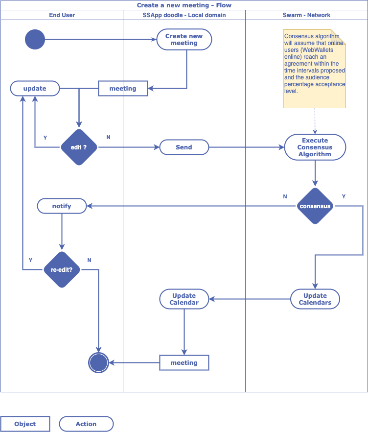

# SAApp Doodle

## Introduction 

The purpose of this application is to provide a dooldle-like experience for the end user, but this time the application runs distributed and the meetings are automatically accepted or rejected, without running a poll, nor human interaction.

## How does it work

The user installs the SSApp Doodle inside his web-wallet and grants access to the SSApp Doodle applicaion to read and write into his callendar. The SSApp Doodle is using CalDAV protocaol (specified in [rfc4791](https://tools.ietf.org/html/rfc4791)) to access the user's calendar (in the example below [Google calendar](https://developers.google.com/calendar/caldav/v2/guide)).
The user can now create a meeting by providing

## SSoddle Architecture Overview

## Swarm description

## Consensus algorithm

A consensus algorithm is a process in computer science used to achieve agreement on a single data value among distributed processes or systems. Consensus algorithms are designed to achieve reliability in a network involving multiple unreliable nodes. Solving that issue -- known as the consensus problem -- is important in distributed computing and multi-agent systems.

To accommodate this reality, consensus algorithms necessarily assume that some processes and systems will be unavailable and that some communications will be lost. As a result, consensus algorithms must be fault-tolerant. They typically assume, for example, that only a portion of nodes will respond but require a response from that portion, such as 51%, at a minimum.

## SSoddle UseCases

### Create a meeting

## SSoodle rest API

`GET` Get users

    http://localhost:8080/rest/api/users

`GET` Get meetings

    http://localhost:8080/rest/api/reunions

`GET` Get meetings for a user

    http://localhost:8080/rest/api/users/1/reunions

`POST` Create user

    http://localhost:8080/rest/api/users

`HEADERS` Content-Typeapplication/json

`BODY` raw

    {
        "email" : "xx@gmail.com",
        "name" : "Name",
        "first-name" : "First Name"
    }

`POST` Create meeting

    http://localhost:8080/rest/api/reunions

`HEADERS` Content-Typeapplication/json

`BODY` raw

    {
        "title": "Meeting: SSApp explained",
        "description": "A first introduction on SSApp; Hands on todo-app",
        "location": "skype:31234",
        "duration": "1:00:00",
        "proposedWindows": [
            {   
                "start": "2020-07-18 11:00:00",
                "end": "2020-07-18 13:30:00"
            },
            {
                "start": "2020-07-19 08:45:00",
                "end": "2020-07-19 11:15:00"
            }
        ],
        "audience": [
            
        ],
        "acceptance": "50%"
    }

These APIs were defined after evaluating what was part of [Doodle API](https://documenter.getpostman.com/view/10109978/SWT7E1Sc?version=latest#intro)  

## Web-Wallet: first run 
The SSApp application loader is the first thing you'll see after running the [web-wallet](https://github.com/PrivateSky/web-wallet) web server and accessing `http://localhost:8080/secure-channels/loader`. It is a basic web application which allows creation and loading of wallets based on the menu wallet template. The SSApp loader registers a service worker responsible with loading the built SSApps from the Brick Storage.
    
    user@pc:~$ git clone git clone https://github.com/PrivateSky/web-wallet.git
    user@pc:~$ cd web-wallet
    user@pc:~/web-wallet$ npm install
    user@pc:~/web-wallet$ npm run server

1. Open http://localhost:8080/secure-channels/loader and choose *New Dossier*

2. Configure the pin (length of 4 digets)

3. Secret seed is generated (keep it safe, it can be used to restore a dossier) and wallet can be opened

1. Enter the pin and launch [*Profile SSApps*](https://github.com/PrivateSky/profile-app)  

## Task List
- [x] Get an overview about [PrivateSky](https://privatesky.xyz/?Howto/a-ssapp)
- [x] Prepare development environment [PrivateSky Installation](https://privatesky.xyz/?Start/installation) 
- [x] Run the Web-Wallet 
- [ ] Follow *How to create a SSApp* [Todo-App](https://privatesky.xyz/?Howto/a-ssapp)
- [ ] Define the major use-cases
- [ ] Complete the architecture overview
- [ ] Define the consensus algorithm
